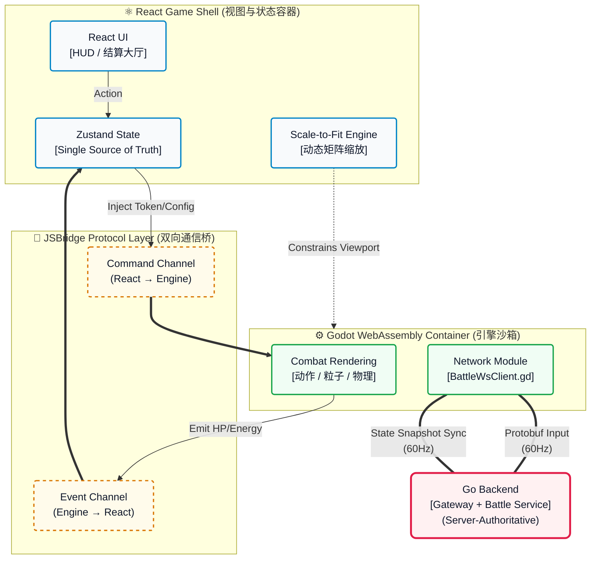

-----

# 🌌 AsterNova Web Client (Game Shell)

   

> **AsterNova Web Client is a Game Shell that orchestrates a WASM-based combat engine with React UI through a dual-channel JSBridge.**

本项目不仅仅是一个 Web 界面，更是一个高度工程化的**基于 Web 的游戏运行时容器 (Web-based Game Runtime Container)**。前端深度接管了全局状态、鉴权链路与移动端硬件级视口适配，并嵌入了一个实时帧同步的 WASM 战斗引擎。

*(💡 建议：在这里放一张 5-10 秒的 GIF 动图，展示 React UI 血条与 Godot 战斗画面的实时联动)*
\`\`

## 🗺️ 运行时架构与状态同步 (Runtime Architecture & Sync)

架构设计的核心在于：**如何通过标准化协议，优雅地控制和约束底层的 WebAssembly 引擎。**



## 🚀 核心工程指标与亮点 (Engineering Highlights)

  * **双向指令通道 (JSBridge Protocol Layer):**
      * **Command Channel (下行):** 将 React 侧的 JWT 令牌、环境路由参数安全穿透至 Wasm 沙箱，赋予引擎直连后端的凭证。
      * **Event Channel (上行):** 引擎内的高频战斗事件（伤害判定、技能 CD）通过跨域总线抛出，由外部统一捕获。
  * **唯一状态源 (Single Source of Truth):**
      * 引入 `Zustand` 作为外壳 UI 与内置游戏状态同步的唯一真相源，彻底杜绝了 DOM 状态与 Canvas 渲染状态脱节的“幽灵 Bug”。
  * **极致性能与网络压榨:**
      * **Load Time 优化:** 利用 Next.js 响应头与服务端配置，强制开启 Brotli/Gzip 对 `.wasm` 与 `.pck` 包体进行极致压缩（体积缩减约 **30%-50%**），大幅降低首屏解析时间。
      * **60Hz 实时同步:** 跨过 Web 层的 HTTP 限制，由内嵌引擎模块直连 Go 后端，承载 `60FPS` 的 Protobuf 二进制状态帧收发。
  * **移动端物理级自适应 (Scale-to-Fit):**
      * 自研 `ScaleFitGameStage` 视口控制器。实时嗅探设备横纵比，基于 `1366x768` 强制计算 CSS Transform Matrix。彻底解决移动端浏览器软键盘遮挡、滑动回弹等原生冲突。

## 📁 架构目录拓扑

```plaintext
AsterNova-Web/
├── app/                        # Next.js App Router 页面路由
│   └── arena/                  # 核心挂载页：容纳 Game Shell 与 WASM 容器
├── public/godot/               # Godot Wasm 编译产物 / Worklet 线程文件
├── src/
│   ├── api/                    # 鉴权中心与 JWT 无状态解析
│   ├── components/
│   │   ├── game-shell/         # 🚀 核心：自适应外壳、全局容错边界 (Error Boundary)
│   │   └── audio/              # 全局音频上下文生命周期接管
│   ├── hooks/                  # 视口矩阵流计算 Hook
│   └── store/                  # Zustand 游戏状态总线
└── next.config.ts              # WASM 资源的 Brotli 压缩与跨域隔离配置
```

## 🚦 快速启动

1.  **环境准备:** 确保本机已安装 Node.js 18+。
2.  **安装依赖与配置:**
    ```bash
    npm install
    cp .env.development .env.local
    ```
    *(注：纯 IP 局域网联机调试时，需在 Chrome 开启 `chrome://flags/#unsafely-treat-insecure-origin-as-secure` 以解禁 SharedArrayBuffer 内存共享限制)*
3.  **启动容器:**
    ```bash
    npm run dev
    ```

-----

*Architected for high-performance Web gameplay. Powered by Next.js & Godot 4.*

-----

